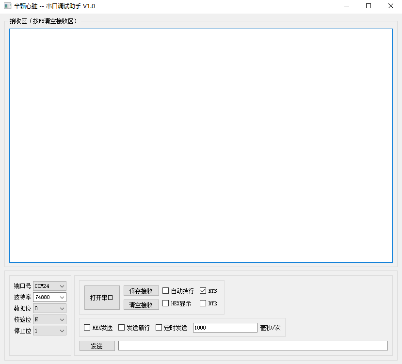

# PyQT5-Serial


<p align="center">
  
</p>

 

这是基于PyQt5打造的一款跨平台的电脑串口调试助手（支持window、MacOS和Linux）

集成了市面上大多串口工具的功能，包括：

```c
- [x] 自定义波特率
- [x] 自动换行
- [x] RTS 控
- [x] DTR 控
- [x] Hex 发送和接收
- [ ] 保存接收
```
下载免安装包：https://xuhonys.coding.net/s/9a32864f-e324-466a-ad2c-0b00763d6980